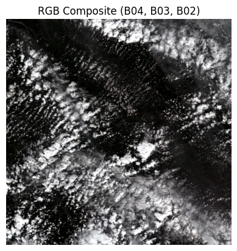
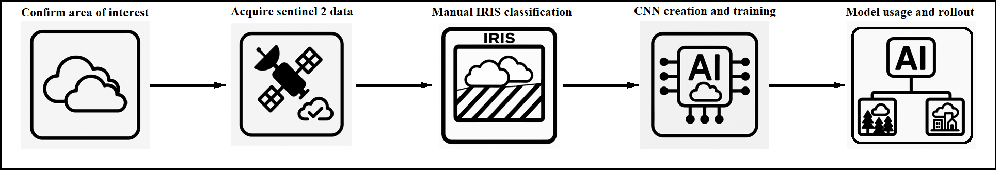
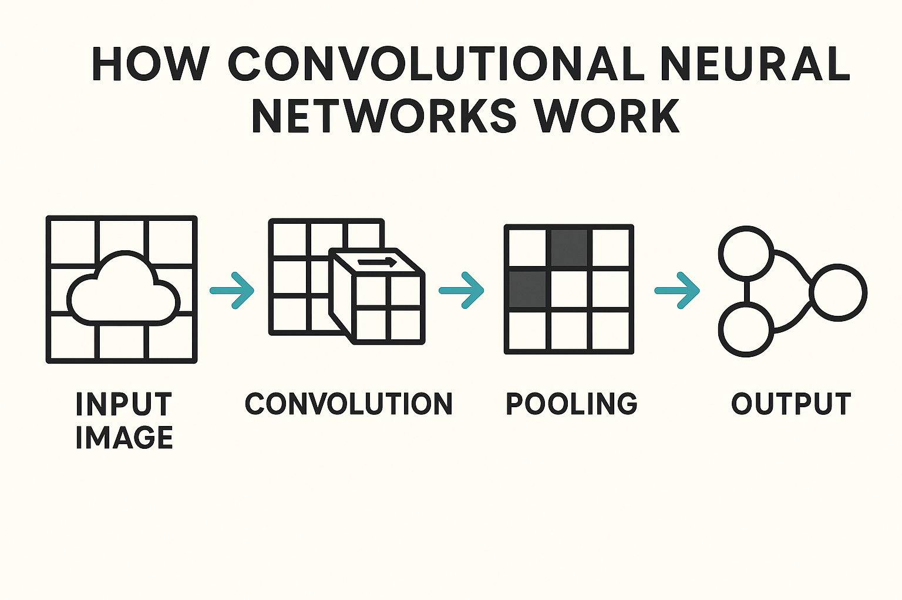

# Cloud Coverage Classification using Sentinel-2 Data and convolutional neural networks

<strong>Project Overview</strong>

Descriptive video: https://youtu.be/ihMHwKFpDAA

This project is based on the classification of cloud coverage using satellite imagery, specifically data from Sentinel-2. The goal is to accurately detect the presence and extent of clouds in imagery using deep learning, namely Convolutional Neural Networks (CNNs). This task is increasingly critical in remote sensing applications, as cloud contamination can severely affect the quality and usability of satellite data.

The notebook implements a supervised learning approach where cloud masks were manually generated using IRIS and then used as training labels for a CNN.
This model was trained and tested on one image, shown below, with it being split into testing and training regions to, then rollout to test its accuracy across the whole image, the times and dates which were used in the corpencious database can be found in the notebook in the repository.

For more detailed instructions and configuration options on setting up IRIS yourself, please refer to the [IRIS GitHub repository](https://github.com/ESA-PhiLab/iris).

---

<strong>Workflow Summary</strong>

- **Data Acquisition**: Satellite data was acquired from Copernicus Open Access Hub using Sentinel-2 imagery.
- **Manual Masking**: IRIS was used to label cloud regions in selected image.
- **Preprocessing**: RGB bands (B04, B03, B02) were extracted and resized
- **Model Architecture**: A lightweight CNN was designed using TensorFlow/Keras.
- **Training & Evaluation**: The model was trained on labelled data and validated on a geographically distinct region by splitting the image into test and train regions.
- **Full Image Rollout**: The trained model was applied to a full-resolution image to assess performance.

---

<strong>Why Quick Cloud Coverage Detection is Useful</strong>

- **Environmental monitoring and research:** Rapid cloud detection supports climate science by enabling more consistent observations of Earth’s surface. This is particularly important for long-term monitoring of vegetation, surface albedo, glacial change, and urban expansion, where frequent cloud cover can obscure key trends.
-  **Pre-inference filtering:** Efficient cloud detection enables users to screen satellite imagery before applying more complex models. This is especially useful in workflows involving land classification or spectral analysis, where cloud-contaminated pixels can degrade model performance. Quickly discarding cloud-heavy images saves time and processing in downstream tasks such as land use classification, vegetation monitoring, or surface temperature retrieval.

- **Scalable deployment across datasets:** The trained CNN model developed in this project can be applied automatically to large volumes of Sentinel-2 imagery. This facilitates the rapid flagging or exclusion of unusable scenes, making it practical to run in batch processing or monitoring pipelines.

---

<strong>Why Use CNN for This Task?</strong>

A Convolutional Neural Network (CNN) is a type of deep learning model specifically designed for processing image data. Unlike traditional neural networks, CNNs use layers called convolutional layers that apply filters (or kernels) across an image to detect patterns such as edges, shapes, textures, and other spatial features.

This makes CNNs particularly well-suited for image classification tasks like cloud detection in satellite imagery, where spatial relationships and patterns are key. By stacking multiple convolutional layers, the model can learn increasingly complex visual features — starting from basic edges to full cloud formations — allowing it to distinguish between cloudy and non-cloudy areas with high accuracy.

**CNNs are powerful because they:**

- Learn directly from raw image data.
- Preserve spatial structure (unlike fully connected layers).
- Are translation-invariant — meaning they recognize features anywhere in the image.

---

<strong>Dependencies</strong>

- TensorFlow  
- NumPy  
- Matplotlib  
- Scikit-image  
- netCDF4

---

<strong>Results</strong>

The CNN achieved strong visual correspondence between predicted cloud masks and manually labelled ground truth. Once trained, the model was able to generalise to unseen regions with reasonable consistency, highlighting distinct cloudy vs. clear zones across large Sentinel-2 scenes.

The predicted cloud mask showed good spatial alignment with known cloud-covered regions.

To quantify performance, the model also calculated an estimated cloud coverage percentage across the full scene using pixel-wise class predictions. The final CNN output allowed for rapid identification of high-cloud-coverage scenes, useful for filtering low-utility images in Earth Observation pipelines.

---

<strong>Environmental Impact Assessment</strong>

This project was executed using Google Colab, which operates on Google Cloud’s energy-efficient infrastructure. The environmental impact of running the notebook was estimated using publicly available data on energy consumption, water usage, and carbon emissions associated with cloud computing.

### Energy Usage

Although exact energy usage depends on the backend assigned (CPU, GPU, or TPU), a typical Colab session running a lightweight CNN is estimated to consume approximately:

**Estimated energy consumption: 0.05–0.15 kWh**

This estimate is based on the following assumptions:

- Power draw of 100–300 W during computation
- Execution time of 30–60 minutes
- Data center overhead represented by a Power Usage Effectiveness (PUE) of ~1.1–1.2

Sources: Strubell et al. (2019); Henderson et al. (2020); Google (2021)

### Water Consumption

According to Google’s 2021 Environmental Report, the company consumed 12.5 billion litres of water while using approximately 18 TWh of electricity, resulting in a Water Usage Effectiveness (WUE) of:

**WUE: ~0.69 litres per kWh**

Estimated water use for this notebook: **3.5–10.5 litres**

This reflects water used primarily for evaporative cooling in data centres (Google, 2021).

### Carbon Emissions

Assuming a global average carbon intensity of electricity of **300–600 g CO₂e/kWh**, estimated emissions are:

**Estimated CO₂ emissions: 15–90 grams CO₂e**

This varies by region and time-of-day usage. (Our World in Data, 2022)

---

<strong>References</strong>

- Google (2021) *Google Environmental Report 2021*. Available at: [https://www.gstatic.com/gumdrop/sustainability/google-2021-environmental-report.pdf](https://www.gstatic.com/gumdrop/sustainability/google-2021-environmental-report.pdf)  
- Henderson, P. et al. (2020) ‘Towards the systematic reporting of the energy and carbon footprints of machine learning’, *arXiv preprint*, arXiv:2002.05651. [https://arxiv.org/abs/2002.05651](https://arxiv.org/abs/2002.05651)  
- IRIS (n.d.) *IRIS – Intelligently Reinforced Image Segmentation*, ESA PhiLab. [https://github.com/ESA-PhiLab/iris](https://github.com/ESA-PhiLab/iris)  
- Masanet, E. et al. (2020) ‘Recalibrating global data center energy use estimates’, *Science*, 367(6481), pp. 984–986. DOI: [10.1126/science.aba3758](https://doi.org/10.1126/science.aba3758)  
- Our World in Data (2022) *Carbon intensity of electricity*. [https://ourworldindata.org/grapher/carbon-intensity-electricity](https://ourworldindata.org/grapher/carbon-intensity-electricity)  
- Strubell, E., Ganesh, A. and McCallum, A. (2019) ‘Energy and policy considerations for deep learning in NLP’, *ACL Proceedings*, pp. 3645–3650. [https://arxiv.org/abs/1906.02243](https://arxiv.org/abs/1906.02243)
- Copernicus: Europe’s eyes on Earth. Available at: https://www.copernicus.eu/en

This project was created for GEOL0069: "Artificial Intelligence For Earth Observation" at University College London (UCL). Some of the notebook code has been adapted and or altered for the purposes and scope of this project.

